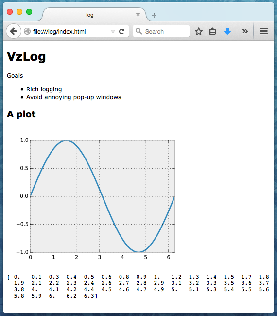

Tutorial
========

The main class of this package is :class:`VzLog <vzlog.VzLog>`, which
manages an HTML output.

Creating a ``VzLog`` object
---------------------------

To start a log saving to the folder `log`, construct a new object as follows::

    from vzlog import VzLog
    vz = VzLog('log')

Refer to the :class:`VzLog <vzlog.VzLog>` for outputting functions. Here
is an example:

.. literalinclude:: ../../examples/doc_example1.py

With the output saved to ``log/index.html``:

Using the default ``VzLog`` object
----------------------------------

Instead of manually creating a VzLog instance, it is more common to
implement one that sets its path automatically:

>>> from vzlog.default import vz

This will draw information from the following environment variables:

``VZ_DIR``
    Directory of all your VzLog outputs.

``VZ_NAME``
    Directory name of your output.

``VZ_FILE_RIGHTS``
    File rights of all your images.

The path of a default VzLog object is constructed by joining ``VZ_DIR`` and
``VZ_NAME``. This means that it is easy to keep a folder with many
different plotting documents. Here is an example where a new directory will be
used::

    $ VZ_NAME=simple python examples/simple_test.py

You can also set these up more permanently by adding them to your
``~/.bashrc``::

    export VZ_DIR=~/html
    export VZ_NAME=plot
    export VZ_FILE_RIGHTS=0775

In this example, your document file will be placed in
``~/html/plot/index.html`` and the file rights 0775 mean that user/group can
read, write and execute and the rest can read and execute.

Plotting with matplotlib
------------------------
When you are plotting directly to file, you want to tell matplotlib not to
start an interactive session. You can do this as follows::

    import matplotlib
    matplotlib.use('Agg')
    import matplotlib.pyplot as plt

Since this is such a common use case in vzlog, the following short-hand will do
this automatically::

    import vzlog.pyplot as plt

This will also tweak the rendering style.
